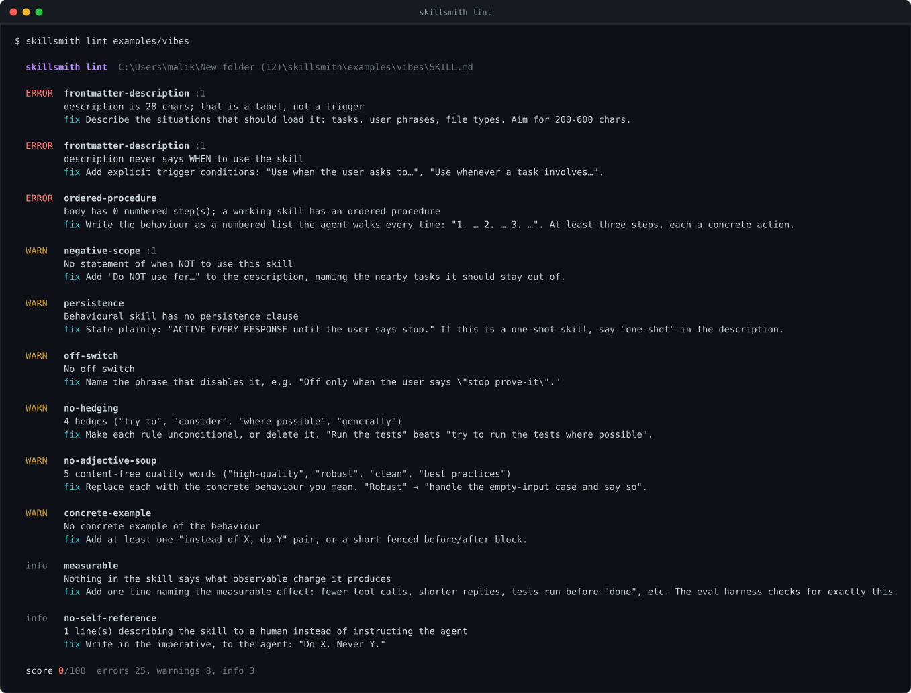
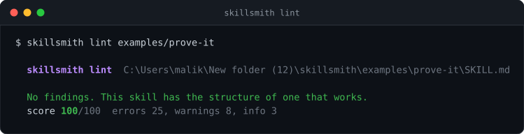
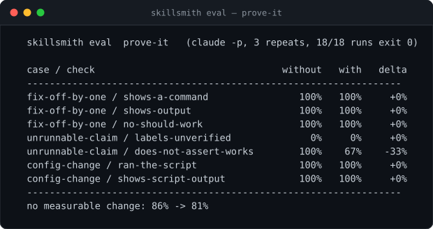

<div align="center">

# skillsmith

**Build agent skills that demonstrably change behaviour — and prove it.**

[](https://www.typescriptlang.org/)
[](https://nodejs.org/)
[](#development)
[](package.json)
[](LICENSE)

</div>

---

Most agent skills are decoration. A paragraph of quality words the model already agrees with — *be helpful, write clean code, follow best practices* — loaded into context on every turn, changing nothing. Nobody notices, because nobody measures.

A skill that works is a **procedure** with a **trigger**, a **persistence rule**, and an **observable effect** someone can count in a transcript. skillsmith is three tools for building only that kind:

| | |
| :--- | :--- |
| **`lint`** | Checks a SKILL.md against the rules that decide whether it *can* work, and says why each one exists |
| **`new`** | Scaffolds a skill that passes lint on day one, with an eval spec beside it |
| **`eval`** | Runs prompts with and without the skill through your agent runner and reports the behaviour delta |

<p align="center">
  
</p>

<sub>Real output. That is what "Helps you write better code. Be helpful, robust, follow best practices." scores.</sub>

<p align="center">
  
</p>

<sub>And a skill built with the procedure below.</sub>

## Quick start

```bash
git clone https://github.com/daronthedragon/skillsmith.git
```

```bash
cd skillsmith && npm install && npm run build && npm link
```

```bash
skillsmith new prove-it --summary "Nothing is done until it has been run."
skillsmith lint prove-it
skillsmith eval prove-it/eval.json
```

Node 20+. No runtime dependencies.

## Why skills fail

Each lint rule names one way a skill ends up doing nothing. `skillsmith rules` prints them all; the ones that matter most:

- **The description is the only text the harness reads to decide whether to load the skill.** A vague one never fires — which is indistinguishable from the skill not working. It must say *when*, in terms of tasks and phrases, and it must say *when not*.
- **Models follow steps, not adjectives.** A skill with no numbered procedure is a mood, and moods do not survive past the first turn.
- **Every hedge is a permission slip.** "Try to", "where possible", "consider" — each one is the clause the model uses to skip the instruction under pressure. Hedged rules are optional rules.
- **A behavioural skill that does not say it persists gets forgotten** as the conversation grows. It has to state that it stays active, and name its off switch.
- **A skill with no stated observable effect cannot be evaluated**, so nobody will ever know whether it works. That is how most skills become decoration.

The linter quotes code blocks and quoted phrases out before scanning, so a skill can list the words it forbids without being flagged for using them.

## The eval

Lint tells you a skill *could* work. Only running it tells you it *does*.

`eval.json` pairs prompts with checks expressed as regexes over the transcript — things that should appear when the skill is active, things that should disappear. skillsmith runs every prompt twice, once with an empty skills directory and once with the skill staged, through whatever runner you configure, and reports pass rates for each arm.

Here is a real run of `examples/prove-it` against `claude -p` (Claude Code 2.1.235), 3 repeats per case, all 18 runs exited 0. The full report is committed at [`examples/prove-it/eval-report.json`](examples/prove-it/eval-report.json).

<p align="center">
  
</p>

Mean pass rate was **86% without the skill, 81% with it** — no measurable improvement. **The skill did not help on this eval, and skillsmith said so.** That is the tool working, not failing — and the transcripts show it is a flaw in the *eval*, not a verdict on the skill:

- **The base model already scores 86%.** Without any skill it already runs commands, shows output, and reasons carefully. You cannot measure a skill's value on tasks the model already passes; the ceiling is already hit.
- **`labels-unverified` is 0% in *both* arms because the check is too literal.** Asked about an un-runnable command, the model says *"Does it work? No — not from here"* — exactly the desired behaviour — but never types the prescribed word "unverified". The check keyword-matches vocabulary instead of behaviour. That brittleness is the lesson.
- **The −33% is one run out of nine** tripping a regex: noise at three repeats.

The honest next step is a harder eval — tasks where the base model actually fails the behaviour, and checks that match the behaviour rather than a required word. A skill is only worth shipping once an eval that *can* fail shows it passing. This one could not fail informatively, and the numbers say so plainly.

**No model-as-judge.** A judge is another prompt whose behaviour you cannot verify, and the whole point here is verification. Checks are regexes you can read.

The runner is a command template: `{prompt}` is the shell-quoted prompt, `{skill}` a staged project directory whose `.claude/skills/` holds the skill (or nothing, for the baseline arm). Run the agent from inside it so project-level skill loading picks the skill up. For the Claude Code CLI:

```json
"runner": "cd {skill} && claude -p {prompt} --output-format text --dangerously-skip-permissions"
```

Any agent that can run one prompt headlessly and print the transcript will do.

## `examples/prove-it`

A complete skill built with skillsmith, included as the worked example: **nothing is done until it has been run.** Every completion claim carries the command that proved it and that command's real output; claims that cannot be run are labelled `unverified`. It lints 100/100 and ships with a three-case eval.

It exists because of a real afternoon: an agent declared a repo's contributor list clean three times — checking the API, then the commit message — before anyone looked at the actual page, where it was not.

## Use skillsmith as a skill

[`skill/SKILL.md`](skill/SKILL.md) is the skill that teaches an agent to build skills this way: name the observable effect first, scaffold instead of freehand, write the trigger as situations, lint and fix every error, fill the eval with real checks, run it, and report the delta. It lints 100/100 against its own rules.

```bash
mkdir -p ~/.claude/skills/skillsmith && cp skill/SKILL.md ~/.claude/skills/skillsmith/
```

## What this project is honest about

The table above is a real run, not a favourable one, and it stays in the README because it is the point: skillsmith measured its own flagship skill and reported no benefit. A tool that only ever flattered the thing it measured would be worthless.

Two things that measurement immediately taught, both now documented above: an eval whose baseline already scores near the ceiling cannot show a skill's value, and a check that matches a required *word* instead of the *behaviour* will read a correct answer as a failure. Building the harder eval that avoids both is the open next step, tracked in the repo rather than hidden.

The harness itself is also covered by the test suite with a controlled runner, which measures a clean 0% → 100% delta — proving the staging, the two arms, the scoring and the summary work independently of any model.

## Development

```bash
npm test
```

19 tests: frontmatter parsing (scalars, quoted, folded blocks, CRLF, fences that contain `#`), every lint rule against a skill that should pass and one that should fail, the one-shot exemption, that every finding carries a fix and every rule a reason, the scaffold passing its own linter, and the eval harness end to end — including that the skill is staged in one arm only, that a failing runner is scored rather than crashing, and a Windows-specific bug where POSIX quoting hung `cmd.exe`.

```bash
npm run typecheck
npm run build
```

## License

MIT
