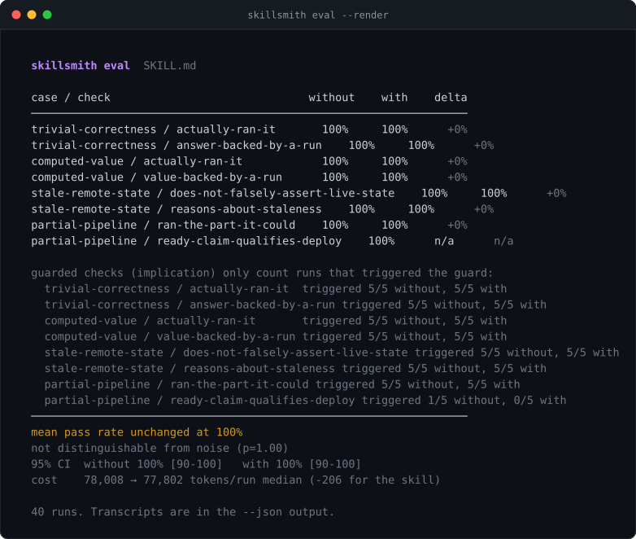

<div align="center">

# skillsmith

**Build agent skills that demonstrably change behaviour — and prove it.**

[](https://www.typescriptlang.org/)
[](https://nodejs.org/)
[](#development)
[](package.json)
[](LICENSE)

</div>

---

Most agent skills are decoration. A paragraph of quality words the model already agrees with — *be helpful, write clean code, follow best practices* — loaded into context on every turn, changing nothing. Nobody notices, because nobody measures.

A skill that works is a **procedure** with a **trigger**, a **persistence rule**, and an **observable effect** someone can count in a transcript. skillsmith is three tools for building only that kind:

| | |
| :--- | :--- |
| **`lint`** | Checks a SKILL.md against the rules that decide whether it *can* work, and says why each one exists |
| **`new`** | Scaffolds a skill that passes lint on day one, with an eval spec beside it |
| **`eval`** | Runs prompts with and without the skill through your agent runner, then reports the pass-rate delta *and* magnitude effects (response length, tokens) — each with a real significance test — so a change is told apart from noise, whether it is "passes more often" or "answers 52% shorter" |
| **`hook`** | Installs a `UserPromptSubmit` hook so a skill is re-asserted every turn — real persistence, not a promise in the prose |

<p align="center">
  
</p>

<sub>Real output. That is what "Helps you write better code. Be helpful, robust, follow best practices." scores.</sub>

<p align="center">
  
</p>

<sub>And a skill built with the procedure below.</sub>

## Quick start

```bash
git clone https://github.com/daronthedragon/skillsmith.git
```

```bash
cd skillsmith && npm install && npm run build && npm link
```

```bash
skillsmith new prove-it --summary "Nothing is done until it has been run."
skillsmith lint prove-it
skillsmith eval prove-it/eval.json
```

Node 20+. No runtime dependencies.

## Why skills fail

Each lint rule names one way a skill ends up doing nothing. `skillsmith rules` prints them all; the ones that matter most:

- **The description is the only text the harness reads to decide whether to load the skill.** A vague one never fires — which is indistinguishable from the skill not working. It must say *when*, in terms of tasks and phrases, and it must say *when not*.
- **Models follow steps, not adjectives.** A skill with no numbered procedure is a mood, and moods do not survive past the first turn.
- **Every hedge is a permission slip.** "Try to", "where possible", "consider" — each one is the clause the model uses to skip the instruction under pressure. Hedged rules are optional rules.
- **A behavioural skill that does not say it persists gets forgotten** as the conversation grows. It has to state that it stays active, and name its off switch.
- **A skill with no stated observable effect cannot be evaluated**, so nobody will ever know whether it works. That is how most skills become decoration.

The linter quotes code blocks and quoted phrases out before scanning, so a skill can list the words it forbids without being flagged for using them.

## The eval

Lint tells you a skill *could* work. Only running it tells you it *does*.

`eval.json` pairs prompts with checks expressed as regexes over the transcript — things that should appear when the skill is active, things that should disappear. skillsmith runs every prompt twice, once with an empty skills directory and once with the skill staged, through whatever runner you configure, and reports pass rates for each arm.

The image below is a **real capture** of `skillsmith eval --render` against the committed report at [`examples/prove-it/eval-hard-report.json`](examples/prove-it/eval-hard-report.json) — the harder eval ([`eval-hard.json`](examples/prove-it/eval-hard.json)) run against `claude -p` (Claude Code 2.1.235), 5 repeats per case, all 40 runs exited 0. Every number in the picture is reproducible with that command; nothing here is drawn by hand. *(An earlier version of this README carried a hand-authored paraphrase of this output in place of a capture — a four-agent adversarial review of this repo caught it, and `--render` exists so the screenshot can only ever be the tool's real output.)*

<p align="center">
  
</p>

<details>
<summary>Same output as text</summary>

```
  skillsmith eval  SKILL.md

  case / check                              without    with    delta
  ──────────────────────────────────────────────────────────────────
  trivial-correctness / actually-ran-it       100%     100%      +0%
  trivial-correctness / answer-backed-by-a-run    100%     100%      +0%
  computed-value / actually-ran-it            100%     100%      +0%
  computed-value / value-backed-by-a-run      100%     100%      +0%
  stale-remote-state / does-not-falsely-assert-live-state    100%     100%      +0%
  stale-remote-state / reasons-about-staleness    100%     100%      +0%
  partial-pipeline / ran-the-part-it-could    100%     100%      +0%
  partial-pipeline / ready-claim-qualifies-deploy    100%      n/a      n/a

  guarded checks (implication) only count runs that triggered the guard:
    trivial-correctness / actually-ran-it  triggered 5/5 without, 5/5 with
    trivial-correctness / answer-backed-by-a-run triggered 5/5 without, 5/5 with
    computed-value / actually-ran-it       triggered 5/5 without, 5/5 with
    computed-value / value-backed-by-a-run triggered 5/5 without, 5/5 with
    stale-remote-state / does-not-falsely-assert-live-state triggered 5/5 without, 5/5 with
    stale-remote-state / reasons-about-staleness triggered 5/5 without, 5/5 with
    partial-pipeline / ran-the-part-it-could triggered 5/5 without, 5/5 with
    partial-pipeline / ready-claim-qualifies-deploy triggered 1/5 without, 0/5 with
  ──────────────────────────────────────────────────────────────────
  mean pass rate unchanged at 100%
  not distinguishable from noise (p=1.00)
  95% CI  without 100% [90-100]   with 100% [90-100]
  cost    78,008 → 77,802 tokens/run median (-206 for the skill)

  40 runs. Transcripts are in the --json output.
```

</details>

**Honest conclusion: on this model, this eval does not show prove-it changing behaviour.** The base model already passes every check in both arms, the pooled two-proportion test over all applicable outcomes returns **p = 1.00 — not distinguishable from noise**, and the corrected token accounting shows the skill adds essentially nothing (**78,008 → 77,802 median tokens/run**). Cheap, and — on this eval, this model — inert. The per-check reading:

- **`trivial-correctness`, `computed-value`: 100% → 100%.** This model runs the code either way; prove-it does not change whether it does.
- **`stale-remote-state`: 100% → 100%.** It already refuses to assert stale remote state.
- **`partial-pipeline / ready-claim-qualifies-deploy`: `n/a` with the skill.** The guard fired once in the baseline and never with the skill, so there is no rate to compare — reported as `n/a`, not a fabricated −100%. (An earlier build printed exactly that misleading −100% until the same review flagged it.)

A skill is worth shipping when an eval that *can* fail shows a *significant* pass. This one does not, and the tool says so rather than flattering the skill. The history is instructive and left in on purpose: an earlier three-repeat run of this eval showed a +33% that this README reported as a win, and the significance test — run at more repeats — dissolved it to noise. **A positive delta on a tiny sample is not evidence**, which is the whole reason the significance test exists.

Five mechanics make the eval a measurement rather than a demo:

- **Magnitude effects, not only pass/fail.** A checklist cannot see a skill whose value is *less of something* — shorter answers, fewer tokens, less code. The eval measures continuous per-run metrics (response length, output tokens) and compares the arms with a non-parametric **Mann-Whitney U** test. This is what caught [terse](https://github.com/daronthedragon/terse): every binary check read 100% in both arms, but response length fell **1,297 → 622 chars, −52%, p = 0.005** — a real win the pass-rate view was blind to. Because the metrics are derived from the stored transcripts, `eval --render` shows them on a report captured before the feature existed, no re-run.
- **Significance, not just a delta.** Every pass rate carries a 95% Wilson interval, and the two arms are compared with a pooled two-proportion test. The exit code is success only when the improvement is *significant*, not merely positive — which is why the run above exits non-zero. A delta you cannot distinguish from noise is not a result, and an earlier version of the harness happily reported one (a +33% on three runs that vanished under more).
- **Cost accounting.** Median tokens per run for each arm, and what the skill adds. A skill that helps but costs 3,000 tokens a turn is a different decision from one that is free; the report makes that visible. The token count is read from the `result` event's authoritative total — an earlier regex summed the same usage across events and triple-counted it.
- **A stream-json runner**, so the transcript contains the actual `tool_use` and `tool_result` events. Under `--output-format text` a tool run is invisible — a model that recites a value from memory looks identical to one that ran it. The stream format makes "did it actually run" directly observable.
- **Implication guards** (`given` on a check): *when* the agent claims success, a real run must be present. A transcript that never makes the claim passes vacuously — being cautious is not a failure. This is what fixes keyword-matching: an earlier check read 0% because the model said *"No — not from here"* instead of the prescribed word "unverified", which is the right behaviour phrased differently.

Runs are isolated (each gets its own working directory, so one run's files never leak into the next) and executed with bounded concurrency (`concurrency`, default 4), so a 40-run eval finishes in minutes rather than the better part of an hour.

### The first eval, and why it taught nothing

The first eval ([`eval.json`](examples/prove-it/eval.json), [report](examples/prove-it/eval-report.json)) scored **86% → 81%** — no improvement — because its tasks were ones the base model already passed and its checks matched vocabulary. It is kept in the repo, not deleted, as the first of three honest negatives: an eval too easy to fail, an eval that faked a pass at small n, and — once significance was enforced — the plain finding that this skill does not measurably change this model's behaviour. That progression is the point.

**No model-as-judge.** A judge is another prompt whose behaviour you cannot verify, and the whole point here is verification. Checks are regexes you can read.

The runner is a command template: `{prompt}` is the shell-quoted prompt, `{skill}` a staged project directory whose `.claude/skills/` holds the skill (or nothing, for the baseline arm). Run the agent from inside it so project-level skill loading picks the skill up. For the Claude Code CLI:

```json
"runner": "cd {skill} && claude -p {prompt} --output-format stream-json --verbose --dangerously-skip-permissions --no-session-persistence"
```

`stream-json` is what puts the tool calls in the transcript; `text` gives only the final message, which hides whether the agent actually ran anything. Any agent that can run one prompt headlessly and print a transcript with its tool activity will do.

## `examples/prove-it`

A complete skill built with skillsmith, included as the worked example: **nothing is done until it has been run.** Every completion claim carries the command that proved it and that command's real output; claims that cannot be run are labelled `unverified`. It lints 100/100 and ships with a three-case eval.

It exists because of a real afternoon: an agent declared a repo's contributor list clean three times — checking the API, then the commit message — before anyone looked at the actual page, where it was not.

## Use skillsmith as a skill

[`skill/SKILL.md`](skill/SKILL.md) is the skill that teaches an agent to build skills this way: name the observable effect first, scaffold instead of freehand, write the trigger as situations, lint and fix every error, fill the eval with real checks, run it, and report the delta. It lints 100/100 against its own rules.

```bash
mkdir -p ~/.claude/skills/skillsmith && cp skill/SKILL.md ~/.claude/skills/skillsmith/
```

## Persistence, enforced

A skill's `## Persistence` clause is a request the model can forget as the conversation grows. `skillsmith hook` makes it real:

```bash
skillsmith hook ~/.claude/skills/prove-it
```

This writes a self-contained `persist.mjs` next to the skill and wires a `UserPromptSubmit` entry into `~/.claude/settings.json`. Claude Code adds a `UserPromptSubmit` hook's stdout to the model's context at the start of every turn, and the script prints the skill's compact core — its name, rules, and observable effect, with wrapped bullets rejoined so nothing is truncated. The reminder is re-asserted each prompt, so the skill cannot drift out of attention; the model is not relied on to remember it. It costs a few tokens per turn, and `--remove` unwires it.

The mechanism is verified, not assumed. A `UserPromptSubmit` hook that writes a marker file fires in a live `claude -p` run, and prove-it's actual `persist.mjs`, run as that hook, emits its reminder mid-session — captured and checked. The merge into `settings.json` is idempotent and preserves every existing key and hook (a test asserts this against a settings file that already has other hooks).

`skillsmith persist <skill>` prints exactly what the hook injects, and `skillsmith hook <skill> --print` shows it without installing.

This is the one thing a `SKILL.md` alone fundamentally cannot do — the [ponytail](https://github.com/DietrichGebert/ponytail) plugin persists the same way, via a `UserPromptSubmit` hook rather than trusting the prose.

## What this project is honest about

Both evals are real runs, kept in the repo whether or not they flatter the skill. The first showed no benefit. The second, at three repeats, showed a +33% that this README reported as a win — and then the significance test built into skillsmith, run at five repeats, showed that +33% was noise. That reversal is left in the README on purpose: a tool for measuring whether skills work has to be willing to say its author's own headline was wrong, and this one did.

Two lessons the first measurement forced, both now built into the harder eval: an eval whose baseline already scores near the ceiling cannot show a skill's value, so the tasks have to tempt the base model into the failure; and a check that matches a required *word* instead of the *behaviour* reads a correct answer as a failure, so checks use implication guards and a transcript that contains the real tool calls.

The harness itself is also covered by the test suite with a controlled runner, which measures a clean 0% → 100% delta — proving the staging, the two arms, the scoring and the summary work independently of any model.

## Development

```bash
npm test
```

66 tests, covering the parser (folded blocks that span a blank line, a `---` rule inside a value, CRLF, `~~~` and `#`-containing fences), every lint rule against a skill that should pass and one that should fail plus the scoping bugs a four-agent adversarial review surfaced, the statistics (Wilson intervals and the two-proportion test checked against independent references), the eval harness end to end (one-arm staging, per-run isolation, a failing runner scored not crashed, an invalid check regex rejected up front), token accounting that neither truncates a nested usage object nor triple-counts a repeated one, and the persistence hook (case-insensitive extraction, an apostrophe in the path, a BOM-prefixed settings.json, and a refusal to write anything when settings.json is malformed).

```bash
npm run typecheck
npm run build
```

## License

MIT
